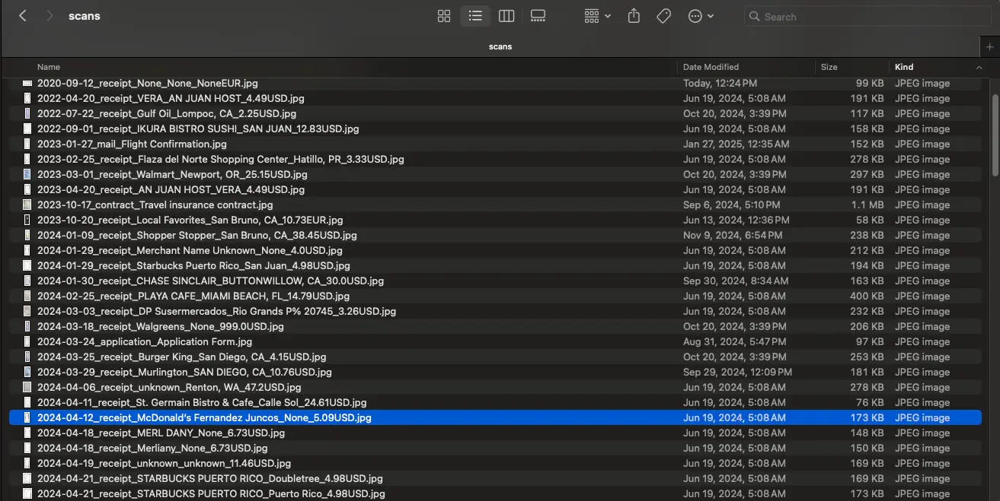

# AI Documents Organizer

[](https://github.com/dzianisv/AiDocumentsOrganizer/actions/workflows/test.yml)

An intelligent document organization tool that automatically classifies and renames scanned documents using OCR and LLMs. It extracts merchant names, amounts, dates, and document types to create meaningful filenames.

## Features

- 📄 **Multi-format Support**: Process images (PNG, JPG, JPEG, TIFF, BMP, GIF) and PDFs
- 🔍 **Smart OCR**: Uses Tesseract OCR with multi-language support (English, Russian, Ukrainian)
- 🤖 **AI-Powered Classification**: Supports both Google Gemini and OpenAI models
- 🏷️ **Intelligent Naming**: Automatically renames files with date, type, merchant, and amount
- 🌍 **Multi-currency**: Recognizes and includes currency codes in filenames
- 🚀 **Auto Model Selection**: Automatically detects and uses available AI models

## Before & After



## Installation

```shell
# Install from GitHub
pip install git+https://github.com/dzianisv/AiDocumentsOrganizer.git

# Or clone and install locally
git clone https://github.com/dzianisv/AiDocumentsOrganizer.git
cd AiDocumentsOrganizer
pip install .
```

### System Requirements

- Python 3.10+
- Tesseract OCR (`brew install tesseract` on macOS, `apt-get install tesseract-ocr` on Ubuntu)
- For PDF support: Poppler (`brew install poppler` on macOS, `apt-get install poppler-utils` on Ubuntu)

## Quick Start

```shell
# Set up your API key (choose one)
export GEMINI_API_KEY="your-gemini-api-key"  # Get from https://makersuite.google.com/app/apikey
# OR
export OPENAI_API_KEY="your-openai-api-key"  # Get from https://platform.openai.com/api-keys

# Process a single document
doc-organizer receipt.jpg

# Process multiple documents
doc-organizer *.png *.pdf

# Specify a model explicitly
doc-organizer --model google:gemini-2.5-flash receipt.jpg
doc-organizer --model openai:gpt-4o document.pdf
```

## Model Configuration

### Automatic Model Detection

The tool automatically selects the best available model based on your environment variables:

1. If `GEMINI_API_KEY` is set → Uses `google:gemini-2.5-flash` (default)
2. If only `OPENAI_API_KEY` is set → Uses `openai:gpt-4o-mini`
3. No API keys → Error with instructions

### Manual Model Selection

You can override automatic detection with the `--model` parameter:

```shell
# Format: provider:model_name
doc-organizer --model google:gemini-2.5-flash receipt.jpg
doc-organizer --model openai:gpt-4o invoice.pdf
doc-organizer --model openai:gpt-4o-mini document.png
```

### Supported Models

**Google Gemini:**
- `google:gemini-2.5-flash` (recommended, fast and accurate)
- `google:gemini-1.5-pro`
- `google:gemini-1.5-flash`

**OpenAI:**
- `openai:gpt-4o` (most capable)
- `openai:gpt-4o-mini` (faster, cheaper)
- `openai:gpt-3.5-turbo` (legacy)

## How It Works

1. **Text Extraction**: Tesseract OCR extracts text from scanned documents
2. **AI Classification**: LLM analyzes the text to identify:
   - Document type (receipt, bill, contract, letter, etc.)
   - Merchant/sender name
   - Date
   - Amount and currency (for receipts/bills)
   - Location
3. **Smart Renaming**: Files are renamed following the pattern:
   - Receipts: `YYYY-MM-DD_receipt_MerchantName_Location_Amount.Currency.ext`
   - Other docs: `YYYY-MM-DD_type_ShortDescription.ext`

## Example Output

```
Original: IMG_20240115_142035.jpg
Renamed:  2024-01-15_receipt_Safeway_SanFrancisco_44.18USD.jpg

Original: scan0001.pdf
Renamed:  2024-01-10_contract_RentalAgreement.pdf
```

## Configuration

### Environment Variables

```shell
# API Keys
export GEMINI_API_KEY="your-key"
export OPENAI_API_KEY="your-key"

# Optional: Custom OpenAI endpoint
export OPENAI_API_BASE="https://your-endpoint.com"
```

## Development

```shell
# Clone the repository
git clone https://github.com/dzianisv/AiDocumentsOrganizer.git
cd AiDocumentsOrganizer

# Install in development mode
pip install -e .

# Run tests
export GEMINI_API_KEY="your-key"
./test.sh
```

## CI/CD

This project uses GitHub Actions for continuous integration. Tests run automatically on:
- Every push to the main branch
- Every pull request

To set up CI for your fork:
1. Go to Settings → Secrets → Actions
2. Add `GEMINI_API_KEY` as a repository secret

## Contributing

Contributions are welcome! Please feel free to submit a Pull Request.

## License

This project is open source and available under the MIT License.


## PDF support

Requires `poppler` to be installed.

```shell
brew install poppler
````